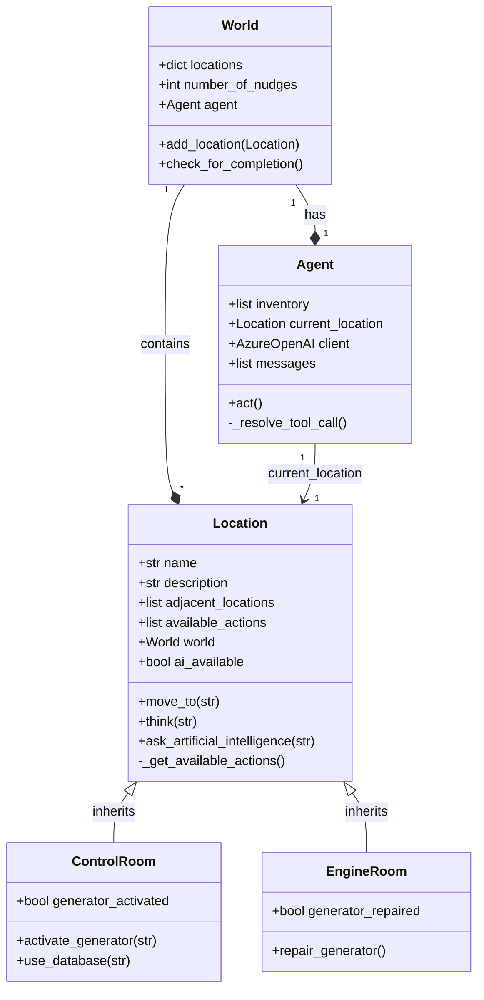

```mermaid
classDiagram
    class World {
        +dict locations
        +int number_of_nudges
        +Agent agent
        +add_location(Location)
        +check_for_completion()
    }

    class Agent {
        +list inventory
        +Location current_location
        +AzureOpenAI client
        +list messages
        +act()
        -_resolve_tool_call()
    }

    class Location {
        +str name
        +str description
        +list adjacent_locations
        +list available_actions
        +World world
        +bool ai_available
        +move_to(str)
        +think(str)
        +ask_artificial_intelligence(str)
        -_get_available_actions()
    }

    class ControlRoom {
        +bool generator_activated
        +activate_generator(str)
        +use_database(str)
    }

    class EngineRoom {
        +bool generator_repaired
        +repair_generator()
    }

    World "1" --* "1" Agent : has
    World "1" --* "*" Location : contains
    Agent "1" --> "1" Location : current_location
    Location <|-- ControlRoom : inherits
    Location <|-- EngineRoom : inherits
```